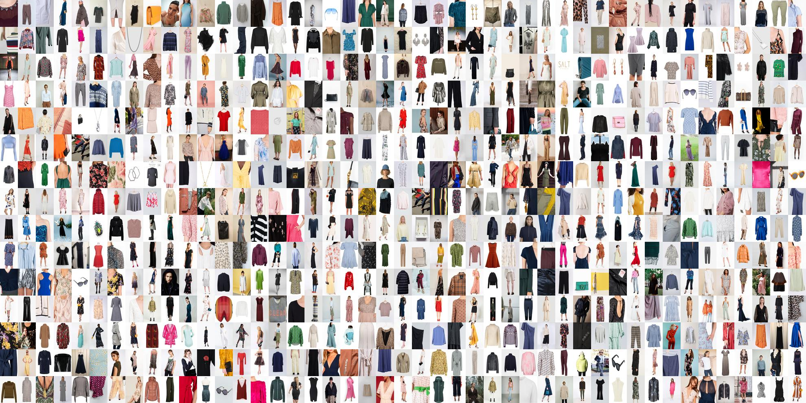

# Clothes Rental Dataset Collection

Repository for assorted scripts collecting and processing the clothes rental dataset.
The dataset will be made available for download at: https://www.kaggle.com/datasets/kaborg15/vibrent-clothes-rental-dataset

Baseline results are calculated in the notebooks:

notebooks/evaluate_dataset_baselines.ipynb

notebooks/evaluate_dataset_baselines_content_based.ipynb

notebooks/evaluate_dataset_baselines_matrix_factorization.ipynb

## A Brief Descrioption of Baseline methods:

### Heuristic Baselines
- **Popular Outfits (Pop)**: Recommends the n globally most commonly rented outfits to every single user.
- **Repeat Outfits (Rep)**: Recommends the n outfits the user has previously rented.
- **Popular and Repeated Outfits (Pop + Rep)**: A combination of Popular Outfits and Repeat Outfits. Recommends repeated items if the user has less than n rentals. Otherwise, the recommendations are padded with the most popular global items.

### Collaborative Filtering Baselines
- **Alternating Least Squares (ALS)**: ALS is a matrix factorization technique particularly effective for handling large-scale and sparse datasets and can incorporate both explicit and implicit feedback [1]. ALS has been applied to our data with 32 factors and regularization of 0.01.
- **Bayesian Personalized Ranking (BPR)**: BPR is a pairwise learning method designed to optimize for personalized ranking. It utilizes a matrix factorization model with the objective of maximizing the difference between the observed positive interactions and unobserved negative interactions [2]. BPR has been applied to our dataset with 128 factors, a regularization of 0.01, and a learning rate of 0.01.

### Content-based Baselines
- **Image Embeddings (Img Embed)**: A content-based approach built on the Vibrent Clothes Rental dataset image embeddings. Recommendations are made by calculating the n nearest neighbors of a mean representation of all images in a user's rental history.
- **Tag Embeddings (Tag Embed)**: A content-based approach built on each outfit's tags. Each outfit's set of tags is one-hot encoded, and a user is represented as the mean embeddings across its rental history. Recommendations are made by calculating the n nearest neighbor outfit embeddings of these user embeddings.
